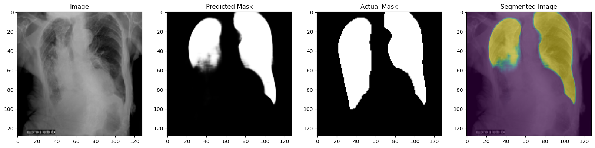

# Lung Segmentation using Attention U-net model
This project focuses on using the Attention-based U-Net model to improve lung segmentation in chest X-rays (CXR), which plays a crucial role in diagnosing diseases like COVID-19. The Attention-based U-Net enhances segmentation accuracy by focusing on the most relevant regions of the lung in each image. This model was compared with three other popular approaches: standard U-Net, ResNet-based U-Net, and VGG-based U-Net. Each model was evaluated based on accuracy, precision, recall, F1-score, Jaccard Index and Dice coefficient.

Among these, the Attention U-Net model achieved the best results, with an accuracy of 98.89% and a Dice coefficient of 97.75%, outperforming the others in all key metrics. This makes it the most reliable model for effective lung segmentation in medical imaging.

## Requirements
1. **Dataset:** The dataset used here is the COVID-19 Radiography Database, which contains 3616 chest X-ray images along with their corresponding lung masks and it can be found in this link below:-

   https://www.kaggle.com/datasets/tawsifurrahman/covid19-radiography-database

2. **Tools:** Python, TensorFlow/Keras, OpenCV, Matplotlib.

3. **Libraries:** U-Net for segmentation.
           Pre-trained ResNet for feature extraction.
          Attention U-Net for improved segmentation accuracy.

## Comparisions
As mentioned earlier, the comparisions with different models have been made and provided in the folder "comparisions" with the code and all the stats.

The results were as follow:-
### ResNet
Showed a recall of 100%, but precision fell to 66.67%, leading to more false positives and an overall accuracy of 80%.
### U-Net
Achieved 97.15% accuracy with a Dice coefficient of 94.27%. Strong in detecting lung regions but not the highest performer.
### VGG-16
This model underperformed significantly compared to the others, with a validation accuracy of only 74.92%. The other metrics like precision and Dice coefficient were all 0.00%, indicating major challenges in accurately segmenting the lung regions.
### Attention U-Net
The best model, achieving an accuracy of 98.89%, a Dice coefficient of 97.75%, and superior performance in lung region identification, outperforming other models.

## Research Paper
Authored by :- Dr.Arun Kumar and [Ms.Prarthana Rout](https://www.linkedin.com/in/lassya/)

Research paper available [here](research_paper.pdf) for reading
